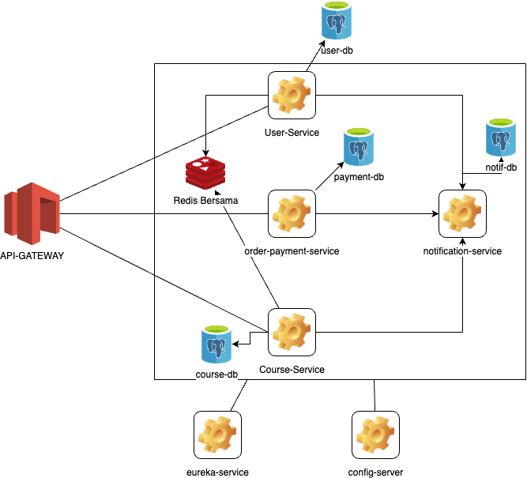

[//]: # (DELETE WHEN CREATE PROJECT ==============)

# `Mini Project Microservice Online-Course`
## `By David Priyadi`

## `Specification:`

Standard | Recommended 
---|--- 
Java | Recommended using java 17
Spring Boot | 3.x.x (Stable Version)

### `Standard Dependency:`
Standard | Recommended        | Mandatory | Reference
---|--------------------| --- | ---
HTTP Client | RestTemplate       | &check;| [Link1](https://docs.spring.io/spring-android/docs/current/reference/html/rest-template.html) 
Database Repository | Jpa Repository     | &check;| [Link](https://docs.spring.io/spring-data/jpa/docs/current/reference/html/#jpa.repositories)
Log Interceptor| Zalando            | &check;|[Link](https://github.com/zalando/logbook)
Validator| Spring validation  | &check;|[Link](https://www.baeldung.com/spring-boot-bean-validation)
Utility | Lombok , Mapstruct | &check;| [Lombok](https://projectlombok.org/) [MapStruct](https://stackabuse.com/guide-to-mapstruct-in-java-advanced-mapping-library/)
Spring Cloud | Spring Cloud Config | &check;| [Link](https://spring.io/projects/spring-cloud-config)
Spring Euraka | Euraka Client | &check;| [Link](https://spring.io/projects/spring-cloud-netflix)
Spring Cloud | Spring Cloud Gateway | &check;| [Link](https://spring.io/projects/spring-cloud-gateway)
Spring Eureka | Eureka Server | &check;| [Link](https://spring.io/projects/spring-cloud-netflix)
Jws | Jws | &check;| [Link](https://jwt.io/)
Spring Data Redis | Redis | &check;| [Link](https://spring.io/projects/spring-data-redis)
Postgres | Postgres | &check;| [Link](https://www.postgresql.org/)
Flyway | Flyway | &check;| [Link](https://flywaydb.org/)
logback | logback | &check;| [Link](http://logback.qos.ch/)

[//]: # (DELETE WHEN CREATE PROJECT ==============)

# Project Name
## Deskripsi Proyek: Mini Project Microservice Online-Course

### Informasi Umum
Proyek ini adalah sistem kursus online berbasis microservice. Sistem ini memisahkan beberapa layanan utama seperti `user-service`, `course-service`, `order-payment-service`, dan `notification-service`. Tujuan dari pemisahan ini adalah untuk memastikan bahwa setiap layanan dapat dikembangkan, di-deploy, dan di-maintain secara independen, sehingga meningkatkan skalabilitas dan maintainability dari sistem secara keseluruhan.

### Layanan Utama

#### User Service
- **Manajemen Pengguna**: Mengelola data pengguna seperti pendaftaran, pembaruan profil, dan penghapusan akun.
- **Login dan Logout**: Menangani autentikasi pengguna, termasuk proses login dan logout.
- **Registrasi**: Menangani pendaftaran pengguna baru.

#### Course Service
- **Create Course**: Menangani pembuatan kursus baru oleh instruktur.
- **Create Chapter**: Menangani pembuatan bab baru dalam kursus.
- **Create Lesson**: Menangani pembuatan pelajaran baru dalam bab.
- **Manajemen Review**: Mengelola ulasan yang diberikan oleh pengguna untuk kursus.
- **Penyimpanan Data Kursus yang Dibeli**: Menyimpan informasi tentang kursus yang telah dibeli oleh pengguna.

#### Order Payment Service
- **Manajemen Transaksi**: Menangani setiap transaksi pembelian kursus oleh pengguna.
- **Order Management**: Mengelola pesanan yang dibuat oleh pengguna.
- **Simulasi Webhook dari Payment Gateway**: Mensimulasikan penerimaan webhook dari payment gateway untuk memproses pembayaran.

#### Notification Service
- **Pengiriman Notifikasi**: Menangani pengiriman notifikasi kepada pengguna melalui berbagai saluran seperti email, SMS, atau push notification.
- **Manajemen Template Notifikasi**: Mengelola template notifikasi yang akan digunakan untuk berbagai jenis pesan.
- **Pengaturan Preferensi Pengguna**: Mengelola preferensi pengguna terkait dengan jenis notifikasi yang ingin mereka terima.
- **Integrasi dengan Layanan Lain**: Berinteraksi dengan layanan lain seperti `order-payment-service` dan `user-service` untuk mengirim notifikasi terkait transaksi atau aktivitas pengguna.

#### Untuk Logging File Configuration ada pada file logback.xml
logging akan di simpan di folder log dan akan di simpan per hari,
logging format yang di gunakan adalah json.

### Setup
1. **Instalasi Dependensi**: Pastikan semua dependensi yang diperlukan sudah termasuk dalam `pom.xml`.
2. **Konfigurasi Aplikasi**: Perbarui `application.properties` dengan konfigurasi yang diperlukan.
3. **Setup Basis Data**: Siapkan basis data PostgreSQL dan Redis.
4. **Jalankan Migrasi**: Gunakan Flyway untuk menjalankan migrasi basis data.
5. **Mulai Layanan**: Gunakan Docker Compose untuk memulai semua microservice.

### Untuk Api Spec ada di folder doc yang akan segera di lengkapi

## Setup

1. masuk ke directory parent project disini online-course-syatem
2. jalankan perintah `mvn clean install` untuk menginstall semua dependensi
2. jalankan perintah `docker-compose up -d` untuk menjalankan semua layanan
3. untuk melihat log dari masing-masing layanan bisa menggunakan perintah `docker-compose logs -f <service-name>`
4. untuk menghentikan layanan bisa menggunakan perintah `docker-compose down`
5. untuk melihat layanan yang berjalan bisa menggunakan perintah `docker-compose ps`
6. Tunggu hingga semua layanan berjalan dengan baik
7. Jika semua layanan sudah berjalan dengan baik, Anda dapat mengakses layanan melalui `http://localhost:8089` gateway gerbang
8. Jika Euroka Server sudah berjalan dengan baik, Anda dapat mengakses layanan melalui `http://localhost:8761` 
9. Jika Eureka Server Error bija restart service eureka dengan perintah `docker-compose restart eureka-server` atau dengan docker dekstop
10. Tunggu Sampe Eureka Server Berjalan dengan baik Seperti ini

### Arsitektur Sederhana

## Developers

- Developer David Priyadi
- Project Belajar Micro dan Docker